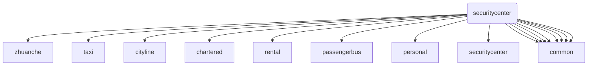

# v6_driver

## 项目介绍
v6司机端

## 软件架构
v6司机端软件架构说明

### component
最底层的基础模块，包括了日常使用到的一些组件，如网络组件、定位组件、更新组件、数据库、常用工具类和视图控件等等。

### common
各个业务层所共有的部分抽出来的一个模块，其中包含了推送组件、抢单接单功能模块、工作台功能模块、我的订单列表模块等等

### zhuanche、taxi、cityline、chartered、rental、passengerbus、personal、securitycenter
这些业务模块分别对应的是专车业务、出租车业务、专线业务、定制包车、包车租车、客运班车、个人中心、安全中心

## 模块间依赖关系

## 参与贡献
 1. Fork 本项目
 2. 新建 Feat_xxx 分支
 3. 提交代码
 4. 新建 Pull Request
 
 
  