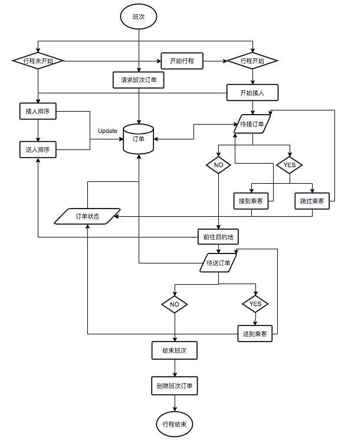
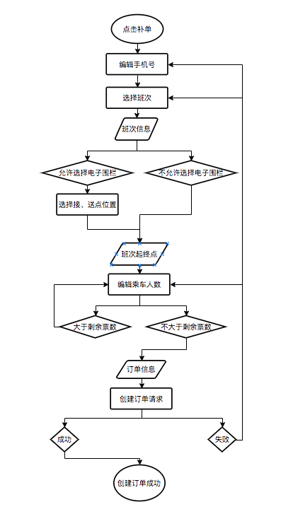

# 城际专线
## 业务流程介绍
* 订单主流程为同一个单一Activity，采用了MVP的设计模式。由不同的fragment来展示不同的订单状态。
* NotStartFragment 为专线行程未开始界面，查询到班次上的订单后，如果是未开始班次，显示此界面，展示专线线路、出发时间、接人时间、接人倒计时等。
* ChangeSeqFragment 为接送排序界面，开始接人时间时间到达后即可进行行程规划。在这个界面司机可以根据距离或者喜好对客户进行拖动排序。
* CusListFragment 为客户列表界面，展示了接客户的顺序或者送客户的顺序以及客户基本信息。
* AcceptSendFragment 为接送客户中的界面，在排序界面完成接人送人排序后开始接人即可进入本页面。在本页面中根据数据库同步的客户情况进行先接人后送人的流程进行操作。
* FinishFragment 为订单完成界面，在接送客户界面，将所有客户送到下车点后就会跳转到这个界面，跳转后意味这个专线的班次完成。

### 专线班次所有状态
```java
 /**
      * 新班次
      */
     public static final int NEW_ORDER = 1;
     /**
      * 已派单
      */
     public static final int PAIDAN_ORDER = 5;
     /**
      * 已接单
      */
     public static final int TAKE_ORDER = 10;
     /**
      * 等待开始行程
      */
     public static final int WAIT_START = 15;
     /**
      * 接人规划
      */
     public static final int ACCEPT_PLAN = 20;
     /**
      * 送人规划
      */
     public static final int SEND_PLAN = 25;
     /**
      * 接人中
      */
     public static final int ACCEPT_ING = 30;
     /**
      * 送人中
      */
     public static final int SEND_ING = 35;
     /**
      * 送完人
      */
     public static final int SEND_OVER = 40;
     /**
      * 行程结束
      */
     public static final int FINISH_TRIP = 45;
```
其中班次状态是从10开始展示的，后台创建了线路班次后，对司机进行排班。排班完成后只有客户买票后司机端才会显示对应班次。默认是已接单等待行程开始状态。

### 专线乘客所有状态
```java
     /**
      * 0 未接 1 已接 2 跳过接 3 未送 4 已送 5 跳过送
      */
     public int status;
```
客户的状态是我们根据操作存在本地数据库的，在每次重新获取班次信息后，会对比本地数据库，已经操作过的客户不进行更改，新客户添加到数据库以保持同步。

### 专线执行流程图


## 专线补单
* 在common公共业务模块中的CreateActivity补单界面中加载对应业务的补单fragment实现不同业务不同补单界面和接口调用。
### 专线补单流程图


### 专线补单注意点
* 补单界面获取到选择的专线班次，如果站点没有设置电子围栏。默认加载起点或者终点的经纬度作为上车点和下车点。
```java
if (stationResult.startStationVo.coordinate.size() == 0) {
     List<MapPositionModel> list = new ArrayList<>();
     MapPositionModel model = new MapPositionModel();
     model.setLatitude(zxOrder.startLat);
     model.setLongitude(zxOrder.startLng);
     list.add(model);

     intent.putParcelableArrayListExtra("pos_list",
            (ArrayList<? extends Parcelable>) list);
} else {
    intent.putParcelableArrayListExtra("pos_list",
            (ArrayList<? extends Parcelable>) stationResult.startStationVo.coordinate);
     }
```

## module结构注意点
### Activity与fragemnt之间ActFragmentBridge接口实现通信
* Activity中对ActFragmentBridge进行初始化和对应方法实现。在fragment的创建时传入ActFragmentBridge的实现对象。
在fragment中进行ActFragmentBridge的对应方法调用。达到fragment中的操作更改activity中的数据。
```java
    /**
     * 规划线路点
     * @param latLngs
     */
    void showBounds(List<LatLng> latLngs);

    /**
     * 添加marker到地图
     * @param latLng
     * @param flag
     */
    void addMarker(LatLng latLng, int flag);
    .
    .
    .
    /**
     * 开始导航
     * @param latLng
     * @param orderId
     */
    void navi(LatLng latLng, Long orderId);
```

