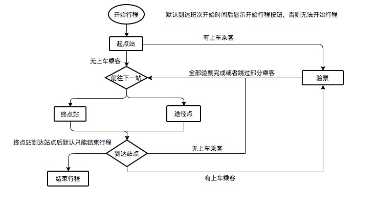

#哈喽定制班车

## 业务流程介绍
* CbRunActivity 班次行程界面，主要工作是展示班次的状态和对应站点信息。
1. 如未开始行程时，显示线路的起点到终点以及出发时间和倒计时。整个班次的所有站点的信息，已经每个站点下需要上车的乘客数量。
2. 开始行程后默认到达第一个起点站。如果起点站有需要上车的乘客，则进行验票操作。验票完成后在乘客列表界面点击前往下一站，如果本站没有上车乘客。则可直接滑动前往下一站。
3. 前往下一站状态中需要将线路上的车的图标显示出来。将站点上的车图标隐藏，以表示车辆在行程中。
4. 到达终点站时默认没有乘客上车。并显示结束行程按钮。滑动结束行程按钮后结束当前班次。
5. 在开始行程、前往下一站、到达站点、到达终点站均有相应的语音提示。根据不同的状态播报对应文字。
* PassengerActivity 乘客验票列表界面。主要工作是展示当前站点下有那些乘客需要验票上车。
1. 目前当前站点没有乘客上车是不能进入这个界面的。进入这个界面后会显示当前站点有那些乘客、以及对应的是否验票上车的状态、总的上车人数和总的未验票人数。
2. 未上车的乘客可以打电话联系。验票上车的乘客则显示已验票。站点验票有对应的倒计时。所有乘客验票完成后或者倒计时到达后跳过乘客前往下一站。
3. 如果不是当前行驶站点，进入这个界面后就只能查看对应站点的乘客信息，用于司机查看对应乘客状态。
* CheckTicketActivity 验票码验票界面 主要工作是输入验票码进行订单查询。以及确认乘客上车。
1. 初始进入界面是只有一个输入框和取消按钮。输入乘客提供的验票码后查询出对应的订单的详情并展示。
2. 查询出对应的订单后点击确认上车即可将订单状态更改为已验票上车。结束界面返回乘客列表并刷新对应乘客状态。
3. 如过根据6位验票码查不出对应的订单信息。则提示了验票码不正确提示。

### 班车班次所有状态
```java
        /**
         * 新班次
         */
        public static final int SCHEDULE_STATUS_NEW = 1;
        /**
         * 班次已出发
         */
        public static final int SCHEDULE_STATUS_RUNNING = 5;
        /**
         * 班次已结束
         */
        public static final int SCHEDULE_STATUS_FINISH = 10;
```

### 班车订单所有状态
```java
          /**
           * 班车订单未支付
           */
          public static final int CITY_COUNTRY_STATUS_PAY = 1;
          /**
           * 班车订单未开始
           */
          public static final int CITY_COUNTRY_STATUS_NEW = 5;
          /**
           * 等待上车(车辆未到达站点)
           */
          public static final int CITY_COUNTRY_STATUS_COMING = 6;
          /**
           * 验票中(车辆已经到达站点)
           */
          public static final int CITY_COUNTRY_STATUS_ARRIVED = 8;
          /**
           * 班车订单行程中
           */
          public static final int CITY_COUNTRY_STATUS_RUNNING = 10;
          /**
           * 班车订单已到达
           */
          public static final int CITY_COUNTRY_STATUS_FINISH = 15;
          /**
           * 班车订单已失效(跳过)
           */
          public static final int CITY_COUNTRY_STATUS_INVALID = 20;
          /**
           * 班车订单已评价
           */
          public static final int CITY_COUNTRY_STATUS_REVIEW = 25;
          /**
           * 班车订单已消单
           */
          public static final int CITY_COUNTRY_STATUS_CANCEL = 30;
```

### 班车执行流程图


