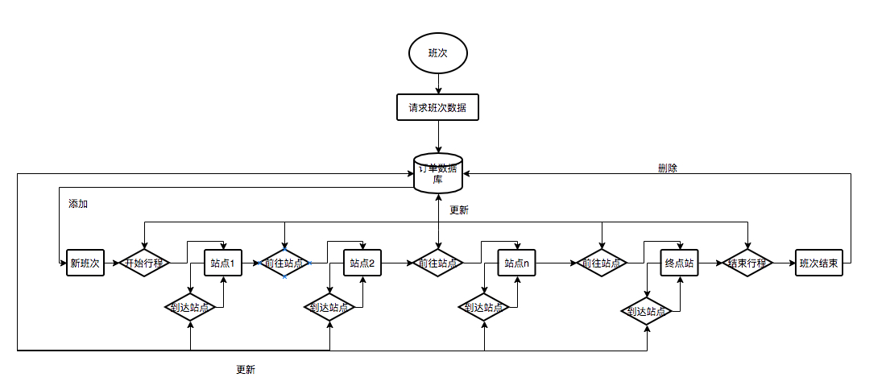

# 客运班车
## 业务流程介绍：
* 订单主流程为同一个单一Activity，采用了MVP的设计模式。由不同的fragment来展示不同的订单状态。
* BcStartFragment为行程未开始界面，主要展示班次的起点终点站点，以及起点到终点的站点先后连线，默认在起点站，点击开始行程进入行程中界面，前往下一个站点。
* BcRuningFragment为行程中的界面。此界面根据站点状态分为前往站点和到达站点两个状态，一个站点达到后显示的将是前往下一个站点。
* BcEndFragment为行程结束界面，主要是在滑动达到终点站后跳转此界面。此界面点击结束行程将代表本班次已完成并退到工作台。

### 业务流程图


### 数据库存储流程
* 工作台点击班次跳转到客运班车模块后，在班车执行界面BcFlowActivity中先查询一次班次的详细信息，获取到对应的详细站点情况
获取到对应的站点后通过遍历所有站点数据，将数据库中不存在的站点用班次id关联存储到数据库。同时删除掉本次班次以外所有的所有站点。

```java
    @Override
    public void findBusOrderById(long id) {
        view.getManager().add(model.findBusOrderById(id).subscribe(new MySubscriber<>(context,
                true,
                true,
                new HaveErrSubscriberListener<EmResult2<BusStationResult>>() {

                    @Override
                    public void onNext(EmResult2<BusStationResult> result) {
                        if (result.getCode() == 1) {
                            for (BusStationsBean busStation : result.getData().stationVos) {
                                if (!BusStationsBean.existsById(busStation.id, result.getData().id)) {
                                    busStation.scheduleId = result.getData().id;
                                    busStation.orderType = Config.COUNTRY;
                                    busStation.save();
                                }
                            }
                            List<BusStationsBean> stations = BusStationsBean.findAll();
                            for (BusStationsBean station : stations) {
                                boolean isExist = false;
                                for (BusStationsBean order : result.getData().stationVos) {
                                    if (order.id == station.id && result.getData().id == station.scheduleId) {
                                        isExist = true;
                                        break;
                                    }
                                }
                                if (!isExist) {
                                    station.delete(station.id,station.scheduleId);
                                }
                            }
                        }
                        view.showBusLineInfo(result.getData());
                    }

                    @Override
                    public void onError(int code) {
                        view.showBusLineInfo(null);
                    }
                })));
    }
```
* 点击开始行程后，将数据库中起点站的状态更改为离开状态，起点站下一个站点的状态更改为前往状态。最后切换到前往中的fragment。
```java
 @Override
    public void showNext() {
        listLine.get(0).status = BusStationsBean.LEAVE_STATION;
        listLine.get(1).status = BusStationsBean.TO_STATION;
        listLine.get(0).updateStatus();
        listLine.get(1).updateStatus();
        switchFragment(bcRuningFragment).commit();
    }
```

* 在滑动到达下个站点后，调用到达站点接口，更改当前站点状态为已到达等待中，并且在数据库中存入等待倒计时的时间，目前默认为10分钟并且开始显示倒计时。
因为每次在查询班次信息后更新本地站点信息的时候是有新站点就插入数据库。已存在的不进行更改。所以在退到工作台后我们更具数据库的状态加载界面也就不会出问题。
对应的状态值没有改变，倒计时也不会紊乱。

```java
if (listLine.get(index).status == BusStationsBean.TO_STATION) {

   bridge.sideToArrived(index);

   listLine.get(index).status = BusStationsBean.ARRIVE_WAIT;
   listLine.get(index).updateStatus();

   listLine.get(index).waitTime = System.currentTimeMillis() + 10 * 60 * 1000 ;
   listLine.get(index).updateWaitTime();

   initTimer(listLine.get(index));
   }
```

* 如果当前的状态是前往站点，到达站点时每次都需要判断一下下一个站点是否是终点站，如果是终点站就先调用达到站点接口，然后切换到行程结束界面。如果不是终点站则继续执行之前的流程。
```java
 if (index == listLine.size() - 1) {
    if (listLine.get(index).status == BusStationsBean.TO_STATION) {
        bridge.sideToArrived(index);
    }
    bridge.showEndFragment();
 }
```

* 当在行程结束界面的时候，点击结束行程班次状态将被更改为已完成。此时的订单司机端将不能在操作或展示。
