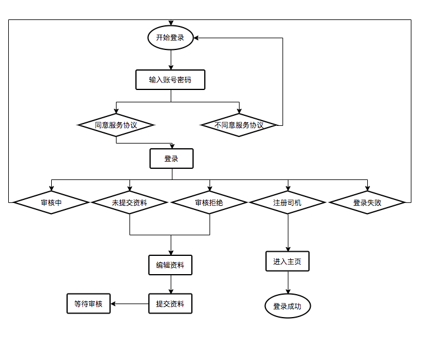
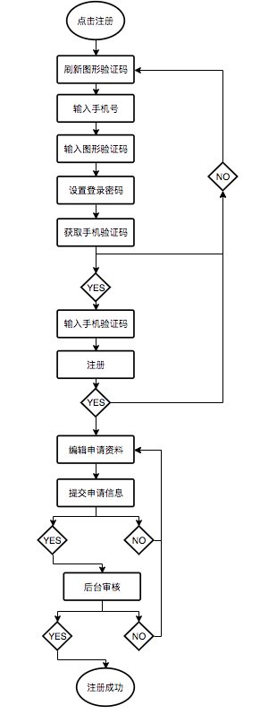

# 个人中心
### 使用中的单页面简述
* 个人中心中主要是放的司机的非业务相关的界面，除登陆注册，其余都是一些关联性较小的单页面。下面对各个界面做一个简述：

| activity     | 界面描述   |  主要功能  |
| --------     | :-----:  | :----:  |
| AboutUsActivity     | 关于我们   |   通过接口获取alias为DriverAboutUs的相关文章信息，以html的形式用webview加载显示在界面中|
| AnnouncementActivity      |   公告列表   |  查询司机相关公告进行展示    |
| ArticleActivity |   文章管理   |  根据tag、articleId、annId加载对应的文章或者公告显示在webview中  |
| ChangeActivity |   修改密码   |  司机登陆中用旧密码修改新密码（注意点：密码都是SHA256加密后传输的）  |
| DetailActivity |   账户明细  |  司机账户明细列表展示  |
| EvaActivity  |    乘客评价    | 乘客对司机服务的评价统计  |
| LanguageActivity |  语言设置  |  切换界面繁体简体文字 |
| LoginActivity |  登陆界面  | 司机账号密码登陆界面 |
| MoreActivity  |  更多功能界面  |  附近厕所、帮助中心、天气预报、系统检查等  |
| MsgActivity  |  消息通知界面 |  主要公告、通知等消息类界面  |
| NaviSetActivity | 导航设置界面  | 主要对导航规划的规划方式进行一个配置   |
| NearWcActivity | 附近厕所  |  高德请求附近厕所点，加载到地图展示  |
| NotifityActivity | 通知列表  |  通知列表数据集合展示 |
| PersonalActivity | 个人中心界面 | 个人中心相关信息展示，功能列表等 |
| PocketActivity |  我的钱包 | 我的钱包界面、包含余额、提现、充值、明细等功能 |
| RechargeActivity | 充值界面 | 余额充值界面，tag根据后台配置显示，默认三个。目前支持支付宝和微信充值 |
| SetActivity | 设置界面 | 修改密码、语言切换、导航设置、关于我们、注销等  |
| TixianActivity | 余额提现 | 余额提现功能、显示提现规则 |
| TixianRecordActivity | 提现记录列表 | 提现记录，通过或者驳回的数据列表 |
| TixianRuleActivity | 提现规则 | 从后台获取的提现规则在webiew中展示 |
| WeatherActivity | 天气预报 | 天气预报获取和展示 |

## 登陆
### 登陆流程图


### 登陆注意点
 * 登陆成功之前的所有接口调用和登陆成功后的接口调用是不一样的。登陆之前的接口加密方式是Rsa加密方式。公钥在资源文件rsa_public_key中。
```java
    /**
     * rsa公钥加密
     *
     * @param data      源数据
     * @param publicKey 公钥(BASE64编码)
     * @return 加密后的值
     * @throws Exception Exception
     */
    public static byte[] encryptByPublicKey(byte[] data, String publicKey) throws Exception {
        PublicKey key = decodePublicKey(publicKey);
        // 对数据加密
        Cipher cipher = Cipher.getInstance(KEY_ALGORITHM_PADDING);
        cipher.init(Cipher.ENCRYPT_MODE, key);
        return doFinal(cipher, data, MAX_ENCRYPT_BLOCK);
    }
```
 * 登陆接口调用时需要传入三个参数，phone、password、randomStr。其中password在做任何加密之前是进行了一次SHA256加密的。项目中所有传输password参数的的都进行了这步操作。
  ```java
 name_rsa = Base64Utils.encode(RsaUtils.encryptByPublicKey(name.getBytes("UTF-8"), getResources().getString(R.string.rsa_public_key)));
 pws_rsa = Base64Utils.encode(RsaUtils.encryptByPublicKey(SHA256Util.getSHA256StrJava(psw).getBytes("UTF-8"), getResources().getString(R.string.rsa_public_key)));
 randomStr_rsa = Base64Utils.encode(RsaUtils.encryptByPublicKey(randomStr.getBytes("UTF-8"), getResources().getString(R.string.rsa_public_key)));
 ```
 * 登陆成功之后的所有接口调用采用的是aes加密。加密密匙是在登陆的时候给后台传的随机生成的16位字符串randomStr，我们保存在项目中，后面使用这个密匙去对接口的参数进行aes加密传输。
```java
    /**
     * 获取16位随机字符串
     * @param length
     * @return
     */
    public static String getRandomString(int length) { //length表示生成字符串的长度
        String base = "abcdefghijklmnopqrstuvwxyz0123456789";
        Random random = new Random();
        StringBuffer sb = new StringBuffer();
        for (int i = 0; i < length; i++) {
            int number = random.nextInt(base.length());
            sb.append(base.charAt(number));
        }
        return sb.toString();
    }
```
 * 其中aes的加密步骤都是放在EncryptInterceptor拦截器中完成。而拦截器拦截的是所有的接口。所以在登陆之前的接口需要手动对参数加密后。再在拦截器中对登陆之前的接口进行过滤放行。
 ```java
    @Override
    public Response intercept(@NonNull Chain chain) throws IOException {

        Request originRequest = chain.request();

        EncryptSet encryptSet = hookRequest(originRequest);

        if (encryptSet == null || encryptSet.request == null) {
            return chain.proceed(originRequest);
        }
        //排除登录及其之前接口，其余接口使用拦截器进行aes加密。
        String url = chain.request().url().toString();
        if (url.contains("api/v1/public/driver/login")
                || url.contains("api/v1/public/driver/register/save")
                || url.contains("api/v1/public/app/captcha/send_sms")
                || url.contains("api/v1/public/driver/register/apply/save")
                || url.contains("api/v1/public/driver/register/get")
                || url.contains("api/v1/public/driver/register/apply/app/save")
                || url.contains("api/v1/public/driver/register/apply/app/update")
        ) {
            return chain.proceed(originRequest);
        }

        return chain.proceed(encryptSet.request.newBuilder()
                .build());
    }
```
## 注册
### 注册流程图


### 注册注意点
  * 注册相关的接口都是在登陆成功之前的。都是使用的rsa加密。返回的是明文。
```java
    /**
     * 调用注册接口
     */
    private void register() {
        String password_rsa = null;
        String phone_rsa = null;
        String smsCode_rsa = null;
        try {
            password_rsa = RsaUtils.encryptAndEncode(this, et_password.getText().toString());
            phone_rsa = RsaUtils.encryptAndEncode(this, et_phone.getText().toString());
            smsCode_rsa = RsaUtils.encryptAndEncode(this, et_code.getText().toString());
        } catch (Exception e) {
            e.printStackTrace();
        }

        Observable<LoginResult> observable = RegisterModel.register(password_rsa, phone_rsa, smsCode_rsa);
        mRxManager.add(observable.subscribe(new MySubscriber<>(this,register_button, emResult -> {
            if (emResult.getCode() == 1) {
                //todo
                startBase(emResult.getEmployInfo());
            }
        })));
    }
```
  * 登陆页面跳转注册页面后，需要先加载出图形验证码，其中图形验证码的加载地址是直接使用接口地址拼接16位随机字符生成。再使用glide直接加载生成地址即可。
```java
    /**
     * 获取图形验证码
     */
    public void getImgCode() {
        randomNum = "" + System.currentTimeMillis() + (int) ((Math.random() * 9 + 1) * 100000);
        Glide.with(this).load(Config.HOST + "api/v1/public/app/captcha/code/" + randomNum).into(iv_image_code);
    }
```
  * 注册界面填入电话号码、图形验证码、验证码、密码后点击注册。后台会生成一个基本的司机信息。但是司机状态是为未提交资料状态。
```java
    /**
     * 注册状态：1.未提交资料；2.审核中；3驳回；4通过
     */
    public int registerStatus;
```
  * 基本司机生成后，会跳转到资料填写界面。需要填写司机的注册资料。只有在资料提交后，后台审核通过。在登陆时才会直接进入工作台。
  * 如果注册生成基本司机后或者资料提交被后台驳回后，使用账号登陆会根据状态提示并跳转到提交资料界面。如果驳回需要根据提示修改资料再提交。
```java
   //1.未提交资料；2.审核中；3驳回；4通过
   if (employ.registerStatus == 4){
      CsEditor editor =  new CsEditor();
      editor.putString(Config.SP_TOKEN, employ.token);
      editor.apply();
      getSetting(employ, name, psw);
   }else if (employ.registerStatus == 3){
      Intent intent = new Intent(this, RegisterNoticeActivity.class);
      intent.putExtra("type", 3);
       startActivity(intent);
   }else if (employ.registerStatus == 2){
      Intent intent = new Intent(this, RegisterNoticeActivity.class);
      intent.putExtra("type", 2);
      startActivity(intent);
   }else if (employ.registerStatus == 1){
      Intent intent = new Intent(this, RegisterBaseActivity.class);
      intent.putExtra("employ",employ);
      startActivity(intent);
   }else {
      CsEditor editor = new CsEditor();
      editor.putString(Config.SP_TOKEN, employ.token);
      editor.apply();
      getSetting(employ, name, psw);
   }
```  
  * 后台审核通过后，司机登陆才会正式进入工作台界面进行后续操作。
 
   
  
