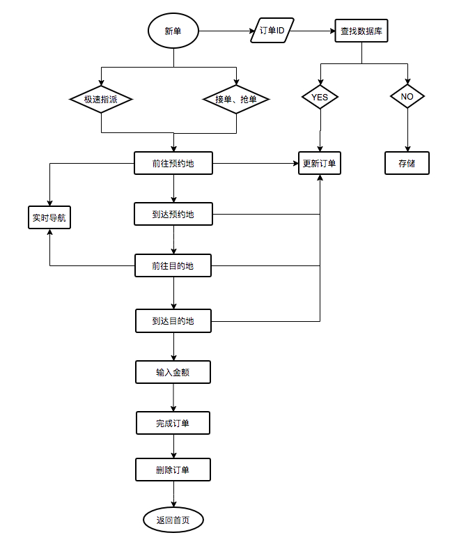

# 出租车
## 业务流程介绍：
* 订单主流程为同一个单一Activity，采用了MVP的设计模式。由不同的fragment来展示不同的订单状态。
* AcceptFragment为接单拒单界面，主要展示订单基本信息和执行接单拒单操作，只有新单派单后没有在抢单派单界面未接单，订单状态为5的时候才会展示。
* ToStartFragment为前往预约地界面。主要是展示订单信息和到预约地的导航路径，可操作到达预约地。
* ArriveStartFragment为到达预约地界面，主要展示的是客户信息以及等待客户上车，上车后点击出发按钮，进入前往目的地状态。
* RunningFragment为前往目的地界面，主要展示的是订单信息和到目的地的导航规划。
点击到达目的地后会弹出费用输入弹窗，输入费用点击确认后，此订单进入结算状态，司机端将不能对订单进行操作和展示。

### 订单所有状态
```java
    /**
     * 新单
     */
    public static final int NEW_ORDER = 1;
    /**
     * 已派单
     */
    public static final int PAIDAN_ORDER = 5;
    /**
     * 前往预约地
     */
    public static final int GOTO_BOOKPALCE_ORDER = 15;
    /**
     * 到达预约地
     */
    public static final int ARRIVAL_BOOKPLACE_ORDER = 20;
    /**
     * 前往目的地
     */
    public static final int GOTO_DESTINATION_ORDER = 25;
    /**
     * 到达目的地
     */
    public static final int ARRIVAL_DESTINATION_ORDER = 30;
    /**
     * 已结算
     */
    public static final int FINISH_ORDER = 35;
    /**
     * 已评价
     */
    public static final int RATED_ORDER = 40;
    /**
     * 已销单
     */
    public static final int CANCEL_ORDER = 45;
```

### 订单执行流程图


## module结构注意点
### 出租车抢单接单TaxiGrabFragment
* 在common 公共业务层模块中的GrabActivity抢单接单界面加载对应业务的fragment实现不同业务不同的抢单界面。

### Activity与fragemnt之间ActFragmentBridge接口实现通信
* Activity中对ActFragmentBridge进行初始化和对应方法实现。在fragment的创建时传入ActFragmentBridge的实现对象。
在fragment中进行ActFragmentBridge的对应方法调用。达到fragment中的操作更改activity中的数据。
```java
    /**
     * 出租车接单
     * @param btn
     */
    void doAccept(LoadingButton btn);
    /**
     * 出租车拒单
     */
    void doRefuse();
    .
    .
    .
    /**
     * 前往目的地
     */
    void showDrive();
```
## 特殊功能实现
### 订单收回、订单取消、订单完成等状态更新
```java
    /**
    * handlepush 中推送是取消订单的时候发送广播
    */
    if (msg.equals("cancel")) {
    //取消订单
     MultipleOrder order = new MultipleOrder();
     order.orderId = jb.optJSONObject("data").optLong("orderId");
     order.serviceType = jb.optJSONObject("data").optString("serviceType");

     Message message = new Message();
     message.what = 1;
     Bundle bundle = new Bundle();
     bundle.putSerializable("order", order);
     message.setData(bundle);
     handler.sendMessage(message);
     }
```
```java
    /**
    * 取消订单广播接收器中收到信息后调用取消订单或者回收的分发接口
    */
    @Override
    public void onReceive(Context context, Intent intent) {
        if (null != intent && null != intent.getAction()) {
            String action = intent.getAction();
            if (action.equals(Config.BROAD_CANCEL_ORDER) || action.equals(Config.BROAD_BACK_ORDER)) {
                if (null != cancelListener) {
                    Long orderId = intent.getLongExtra("orderId", -1);
                    String orderType = intent.getStringExtra("orderType");
                    if(action.equals(Config.BROAD_CANCEL_ORDER)){
                        cancelListener.onCancelOrder(orderId, orderType,context.getString(R.string.canceled_order));
                    } else {
                        cancelListener.onCancelOrder(orderId, orderType,context.getString(R.string.backed_order));
                    }
                }
            }
        }
    }
```
```java
    /**
    * 在对应的界面实现OnCancelListener接口，进行对应处理
    */
    @Override
    public void onCancelOrder(long orderId, String orderType, String msg) {
        if (taxiOrder == null) {
            return;
        }
        if (orderId == taxiOrder.id&& orderType.equals(taxiOrder.serviceType)) {
            AlertDialog dialog = new AlertDialog.Builder(this)
                    .setMessage(msg)
                    .setPositiveButton(R.string.ok, (dialog1, which) -> {
                        dialog1.dismiss();
                        finish();
                    })
                    .setOnDismissListener(dialog12 -> finish())
                    .create();
            dialog.show();
        }
    }
```
* 订单收回和订单完成流程基本同取消订单一样
  


