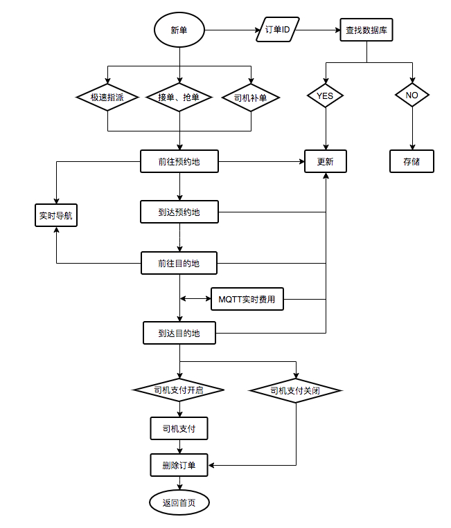

# 专车
## 业务流程介绍：
* 订单主流程为同一个单一Activity，采用了MVP的设计模式。由不同的fragment来展示不同的订单状态。
* AcceptFragment为接单拒单界面，主要展示订单基本信息和执行接单拒单操作，只有新单派单后没有在抢单派单界面未接单，订单状态为5的时候才会展示。
* ToStartFragment为前往预约地界面。主要是展示订单信息和到预约地的导航路径，可操作到达预约地。
* ArriveStartFragment为到达预约地界面，主要展示的是客户信息以及等待客户上车，上车后点击出发按钮，进入前往目的地状态。
* RunningFragment为前往目的地界面，主要展示的是订单信息和到目的地的导航规划。
点击到达目的地后会弹出费用信息弹窗，确认无误后点击确认费用，此时根据后台配置司机能否代付决定是否弹窗司机代付弹窗。
司机代付或者客户付款，此订单进入结算状态，司机端将不能对订单进行操作和展示。

### 订单所有状态
```java
 /**
     * 新单
     */
    public static final int NEW_ORDER = 1;
    /**
     * 已派单
     */
    public static final int PAIDAN_ORDER = 5;
    /**
     * 前往预约地
     */
    public static final int GOTO_BOOKPALCE_ORDER = 15;
    /**
     * 到达预约地
     */
    public static final int ARRIVAL_BOOKPLACE_ORDER = 20;
    /**
     * 前往目的地
     */
    public static final int GOTO_DESTINATION_ORDER = 25;
    /**
     * 中途等待
     */
    public static final int START_WAIT_ORDER = 28;
    /**
     * 到达目的地
     */
    public static final int ARRIVAL_DESTINATION_ORDER = 30;
    /**
     * 已结算
     */
    public static final int FINISH_ORDER = 35;
    /**
     * 已评价
     */
    public static final int RATED_ORDER = 40;
    /**
     * 已销单
     */
    public static final int CANCEL_ORDER = 45;
```

### 订单执行流程图


## module结构注意点
### 专车抢单接单ZCGrabFragment
* 在common 公共业务层模块中的GrabActivity抢单接单界面加载对应业务的fragment实现不同业务不同的抢单界面。

### 补单模块create
* 在common公共业务模块中的CreateActivity补单界面中加载对应业务的补单fragment实现不同业务不同补单界面和接口调用。

### Activity与fragemnt之间ActFragmentBridge接口实现通信
* Activity中对ActFragmentBridge进行初始化和对应方法实现。在fragment的创建时传入ActFragmentBridge的实现对象。
在fragment中进行ActFragmentBridge的对应方法调用。达到fragment中的操作更改activity中的数据。
```java
 /**
     * 专车接单
     * @param btn
     */
    void doAccept(LoadingButton btn);
    /**
     * 专车拒单
     */
    void doRefuse();
    .
    .
    .
    /**
     * 显示费用详情
     */
    void toFeeDetail();    
```
## 特殊功能实现
### 跑单费用实时动态更改
```java
/**
* 费用信息监听分发接口
*/
public interface FeeChangeSubject {
    /**
     * 添加观察者
     * @param obj
     */
    void addObserver(FeeChangeObserver obj);

    /**
     * 移除观察者
     * @param obj
     */
    void deleteObserver(FeeChangeObserver obj);

    /**
     * 当主题方法改变时,这个方法被调用,通知所有的观察
     * @param orderId
     * @param orderType
     */
    void notifyObserver(long orderId,String orderType);
}
/**
* 专车费用信息观察者
*/
public interface FeeChangeObserver {
    /**
     * 专车费用信息观察者
     * @param orderId
     * @param orderType
     */
    void feeChanged(long orderId, String orderType);
}
```
   实现步骤：
   * 在Handlepush中实现FeeChangeSubject ，费用推送信息来了后先更改本地数据库中对应订单的费用信息。再调用notifyObserver通知所有实现FeeChangeObserver接口的界面
```java
    @Override
    public void notifyObserver(long orderId, String orderType) {
        if (null == observers) {
            return;
        }
        for (FeeChangeObserver observer : observers) {
            observer.feeChanged(orderId, orderType);
        }
    }   
```
* 在FlowActivity中实现FeeChangeObserver，当触发其实现方法feeChanged后将对应费用信息传递到对应fragment进行费用信息更新展示。
```java
    @Override
    public void feeChanged(long orderId, String orderType) {
        if (zcOrder == null) {
            return;
        }
        if (orderId == zcOrder.orderId && orderType.equals(Config.ZHUANCHE)) {
            DymOrder dyo = DymOrder.findByIDType(orderId, orderType);
            if (null != waitFragment && waitFragment.isVisible()) {
                waitFragment.showFee(dyo);
            } else if (null != runningFragment && runningFragment.isVisible()) {
                runningFragment.showFee(dyo);
            }
            if (null != settleFragmentDialog && settleFragmentDialog.isShowing()) {
                settleFragmentDialog.setDymOrder(dyo);
            }
        }
    }
```
### 乘客实时位置点 
* 实现方式基本同动态费用信息一样，只是在在刚进入界面的时候去调用了一次获取乘客位置的接口。
```java
    /**
     * 获取乘客位置
     *
     * @param orderId
     */
    public void passengerLoc(long orderId) {
        Observable<PassengerLcResult> observable = ApiManager.getInstance().createApi(Config.HOST, ZCApiService.class)
                .passengerLoc(orderId)
                .subscribeOn(Schedulers.io())
                .observeOn(AndroidSchedulers.mainThread());

        observable.subscribe(new MySubscriber<>(this, false, false, passengerLcResult -> {
            if (passengerLcResult.getCode() == 1) {
                plChange(passengerLcResult.data);
            }
        }));
    }
```


